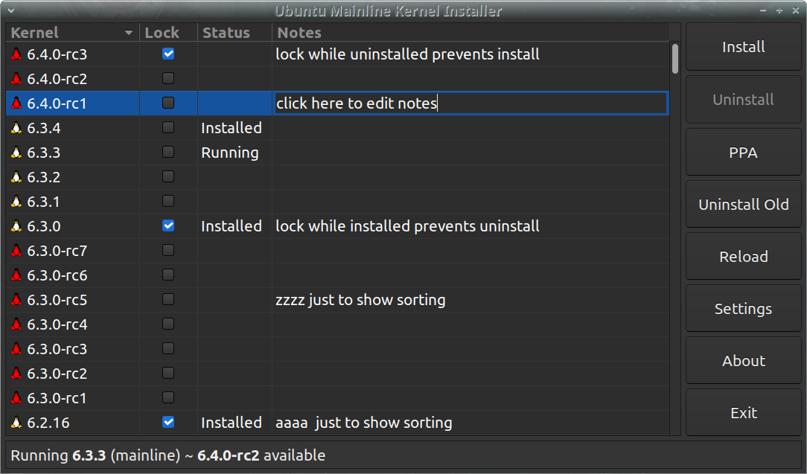

### Ubuntu Mainline Kernel Installer
This is a tool for installing the latest mainline Linux kernel on Ubuntu-based distributions.

### Features
* Fetches list of available kernels from [Ubuntu Mainline PPA](http://kernel.ubuntu.com/~kernel-ppa/mainline/)
* Optionally watches and displays notifications when a new kernel update is available
* Downloads and installs packages automatically
* Display available and installed kernels conveniently
* Install/Uninstall kernels from gui
* For each kernel, the related packages (headers & modules) are installed or uninstalled at the same time

### Downloads & Source Code
mainline is written using Vala and GTK3. Source code and binaries are available from the [GitHub project page](https://github.com/bkw777/mainline).

[cappelikan](https://github.com/cappelikan) maintains a PPA at: <https://code.launchpad.net/~cappelikan/+archive/ubuntu/ppa>

	sudo add-apt-repository ppa:cappelikan/ppa
	sudo apt update
	sudo apt install mainline

### Build
	sudo apt install libgee-0.8-dev libjson-glib-dev libvte-2.91-dev valac aria2 lsb-release aptitude
	git clone https://github.com/bkw777/mainline.git
	cd mainline
	make
	sudo make install

### About
mainline is a fork of [ukuu](https://github.com/teejee2008/ukuu)

The original author stopped maintaining the original GPL version of ukuu and switched to a [paid license](https://teejeetech.in/tag/ukuu/) for future versions.

### Enhancements / Deviations from the original author's final GPL version
* (from [stevenpowerd](https://github.com/stevenpowered/ukuu)) Options controlling the internet connection check
* (from [cloyce](https://github.com/cloyce/ukuu)) Option to include or hide pre-release kernels
* Changed name from "ukuu" to "mainline"
* Removed all GRUB options
* Removed all donate buttons, links, dialogs
* Remove source cruft
* Better temp and cache directory behavior
* Better desktop notification behavior

### TODO & WIP
* Make the notification bg process detect when the user logs off and exit itself.
* Save & restore window dimensions.
* Move the notification/dbus code into the app and make an "applet mode"
