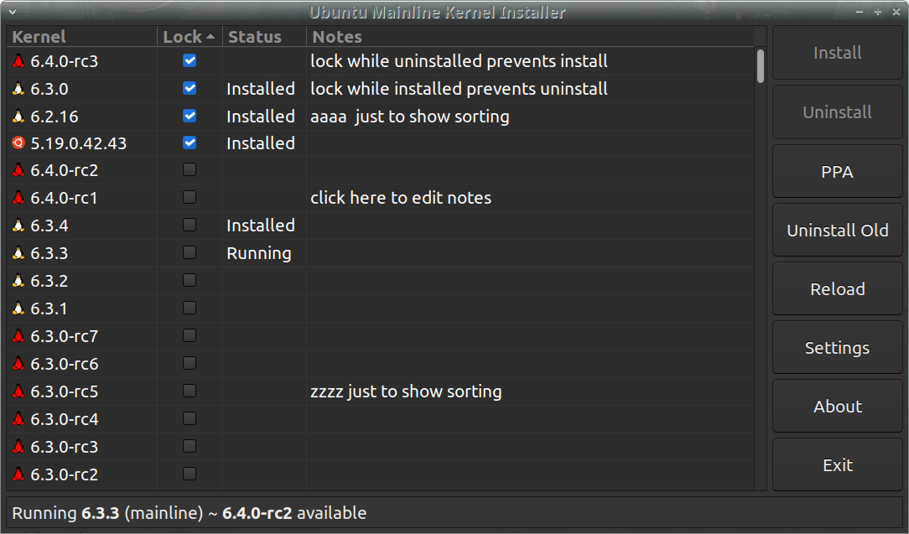
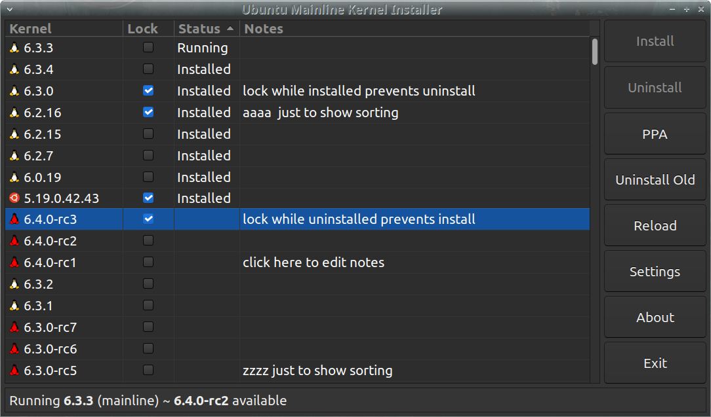
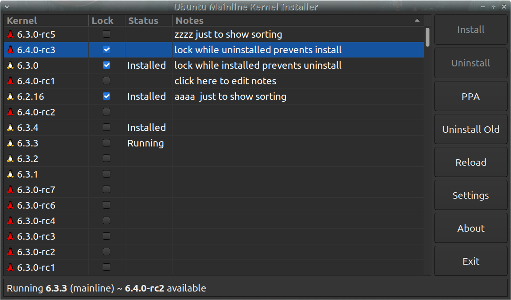

# Ubuntu Mainline Kernel Installer
A tool for installing [Ubuntu Mainline Kernel Builds](https://wiki.ubuntu.com/Kernel/MainlineBuilds) onto debian-based distributions.


Sort by the Lock column to collect all the locked kernels together


Sort by the Status column to collect all the installed kernels together


Sort by the Notes column to see all kernels with any remarks


## About
mainline is a fork of [ukuu](https://github.com/teejee2008/ukuu)  

## Changes
* Changed name from "ukuu" to "mainline"
* Removed all GRUB / bootloader options
* Removed all donate buttons, links, dialogs
* Removed un-related/un-used code
* Better temp and cache management
* Better desktop notification behavior
* Reduced dependencies (ex: no longer uses aptitude, just dpkg)
* Per-Kernel User Notes
* Pinning/Locking Kernels
* Slow but ongoing re-writes of most parts

## Features
* Download the list of available kernels from the [Ubuntu Mainline PPA](http://kernel.ubuntu.com/~kernel-ppa/mainline/)
* Display, install, uninstall, available and installed kernels conveniently, gui and cli
* For each kernel, the related headers & modules packages are automatically grouped and installed or uninstalled at the same time
* Optionally monitor and send desktop notifications when new kernels become available

## Not Features
* Care if the kernels run or boot or are compatible with your system beyond the basic plaform arch and whatever dependencies the .deb packages declare and dpkg enforces. The mainline-ppa kernel deb packages are produced with no warranty. When they work, great, when they don't, don't use them. This app intentionally does not even touch a single grub or bootloader file itself. All it does is download .deb packages that the ubuntu kernel team authors, and runs dpkg to install them the same way you would manually.

# Install
The [PPA](https://code.launchpad.net/~cappelikan/+archive/ubuntu/ppa) is kindly maintained by [cappelikan](https://github.com/cappelikan)  
```
sudo add-apt-repository ppa:cappelikan/ppa
sudo apt update
sudo apt install mainline
```
There is also usually a single reference .deb package in [releases](../../releases/latest), generated by ```make release_deb```  

# Build
```
sudo apt install libgee-0.8-dev libjson-glib-dev libvte-2.91-dev valac aria2 lsb-release make gettext dpkg-dev
git clone https://github.com/bkw777/mainline.git
cd mainline
make
sudo make install
```

# Usage
Look for System -> Ubuntu Mainline Kernel Installer in your desktop's Applications/Start menu.

Otherwise:  
CLI
```
$ mainline --help
$ mainline
```
GUI
```
$ mainline-gtk
```
Note that neither of those commands invoked sudo or pkexec or other su-alike.  
The app runs as the user and uses pkexec internally just for the dpkg command.

## Buttons
**\[ Install \]** - downloads and installs the selected kernel

**\[ Uninstall \]** - uninstalls the selected kernel(1)

**\[ PPA \]** - launches your default https:// handler to the web page for the selected kernel  
If no kernels are selected (when first launching the app before clicking on any) launches the main page listing all the kernels.  
Use this to see the build summary and CHANGES files.

**\[ Uninstall Old \]** - uninstalls all installed kernels below the latest installed version(1)

**\[ Reload \]** - deletes, re-downloads, and re-reads the local cached copies of all the index.html's from the mainline-ppa web site, and regenerates the displayed list.  

**\[ Settings \]** - access the [settings](settings.md) dialog to configure various options

**\[ About \]** - basic info and credits

**\[ Exit \]** - order pizza

(1) The currently running kernel and any locked kernels are protected and ignored.

## Pinning / Locking
The Lock checkboxes serve as both whitelist and blacklist.

A locked kernel will be frozen in whatever state it was in when you locked it.  
If it was installed, it will now stay installed.  
If it was not installed, it will now stay uninstalled.

All forms of install/uninstall commands & methods are affected.  
The gui "Install" and "Uninstall" buttons are inactive on that kernel.  
The cli "--install" and "--uninstall" commands ignore that kernel.  
The gui "Uninstall Old" button and the cli "--uninstall-old" command ignore that kernel.  
The cli "--install-latest" and "--notify" for the background notification ignore that kernel.  
The kernel is still visible, you can still write notes and pull up the PPA info page and toggle the lock to unlock it.

This can be handy to keep a stock distribution kernel from being uninstalled by "Uninstall Old", or prevent a known buggy kernel from being installed by "--install-latest" and prevent "--notify" from generating a notification to install it.

## Notes
Clicking on the Notes field allows to attach arbitrary note text to a kernel.

## Display Sorting
All column headers are clickable to re-sort the list.  
The "Kernel" coulumn sorts by the special kernel version number sort where "1.2.3-rc3" is higher than "1.2.3-rc2", yet "1.2.3" is higher than "1.2.3-rc3".  
Sorting on the "Lock" column is a way to see all locked kernels together.  
Sorting on the "Status" column is a way to see all installed kernels together.  
Sorting on the "Notes" column is a way to see all kernels that have any notes together.  

# Help / FAQ

* [MainlineBuilds WIKI](https://wiki.ubuntu.com/Kernel/MainlineBuilds)

* General debugging  
  The `-v` or `-v [0-999]` or the environment variable `VERBOSE=[0-999]` enables increasing levels of verbosity.  
  Example: `$ mainline-gtk -v 3` or `$ VERBOSE=3 mainline-gtk`  
  The -v option may also be used alone or repeated. The default is the same as `-v 1`.  
  Each additional `-v` is like adding 1. ie: `-v -v -v` is like `-v 4` or `VERBOSE=4`  
  0 = silence all output  
  1 = normal output (default)  
  2 = same as --debug  
  3 = more verbose  
  4 = even more  
  5+ mostly just for uncommenting things in the code and recompiling, not really useful in the release builds

* If **Uninstall Old** doesn't remove some distribution kernel packages  
  Use the normal package manager like apt or synaptic to remove the parent meta-package:  
  ```$ sudo apt remove linux-image-generic```  
  Then **Uninstall Old** should successfully remove everything.  
  Also you should hit the **Reload** button once after that (or run ```$ mainline --delete-cache```)  

* Secure Boot  
  Possibly useful, I have not tried:  
  https://github.com/M-P-P-C/Signing-a-Linux-Kernel-for-Secure-Boot

* Kernel versions 5.15.7+ and libssl3  
  [Install libssl3](../../wiki/Install-libssl3)

* Missing kernels  
  Failed or incomplete builds for your platform/arch are not shown.  
  If you think the list is missing a kernel, press the "PPA" button to jump to the mainline-ppa web site where the .deb packages come from, and look at the build results for the missing kernel, and you will usually find that it is a failed or incomplete build, and can not be installed. You can also press the "Reload" button to force a full re-download of all info about the kernels.

# TODO & WIP
* Add some extra info into the version strings used for display and --install etc, to better handle multiple kernels of the same main version but from different sources, and other differences like builds and platform/feature options etc  
* Replace Process.spawn_async_with_pipes("aria2c ...",...) with libcurl  
* Make the background process for notifications detect when the user logs out of the desktop session and exit itself  
* Move the notification/dbus code from the current shell script into the app and make an "applet" mode  
* Combine the gtk and cli apps into one, or, make the gtk app into a pure front-end for the cli app, either way  
* Replace the commandline parser  
* Toggle display of invalid kernels so you could at least see they aren't simply missing, and use the "PPA" button too  
* UI quick toggle for show/hide unstable/-rc kernels instead of going to settings  
* Right-click menu for more functions for a given kernel, such as reloading the cache just for a single kernel to check for new build status etc, without adding 18 buttons all over the ui.  
* Support all installable kernel variants, not just "-generic"  
* Add commandline flags for all settings. Currently the console app is controlled by several settings that it has no way to edit or override, other than by the user manually editing config.json  
